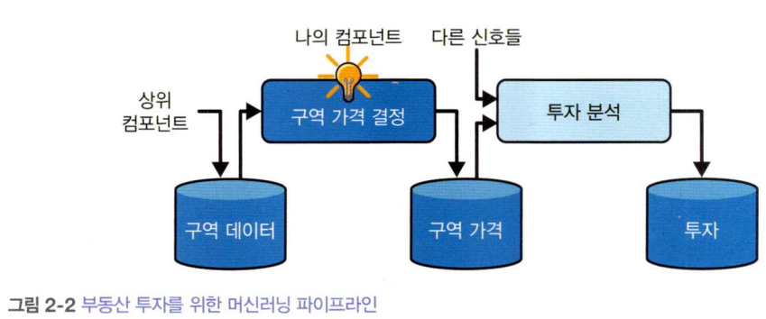

# Chapter 2. End to End Machine learning project

## Real data
California Housing prices (1990)

## Machine learning pipeline

This is data pipeline of project

### pipeline?
pipeline은 데이터베이스 component들이 연속되어 있는 것, 비동기적으로 작동하며 다른 컴포넌트와 연결된 부분은 데이터 저장소 뿐임

## 작업 분류
Labled 된 데이터가 존재하므로 전형적인 지도학습, 다중회귀 문제임
데이터는 연속적이지 않고 충분히 작으므로 mapreduce와 같은 분산 처리 없이 단순 배치로 학습

## 성능지표
평균 제곱근 오차 사용, 이상치가 많다면 평균 절대오차 사용 고려
이들 모두는 모두는 예측 값의 벡터와 타깃 값의 벡터 사이의 거리를 측정하는 방법, 거리 측정에는 다양한 방법 (노름, norm)을 사용할 수 있음

## 프로젝트의 흐름 (Jupiter notebook 기준 위치)
데이터 다운로드, 확인, 테스트케이스 분리(2.3) -> 데이터 시각화 (2.4),

데이터 전처리 (2.5) -> 모델 선택과 훈련(2.6) -> 모델 미세 튜닝 (2.7),

런칭 (2.8)

## 데이터 전처리
### 정제
누락, 오류가 발생한 데이터를 처리하는 과정
- 해당 구역 제거
- 전체 특성 삭제
- 누락 값 채우기 (대체)

Pandas를 사용하면 필요한 값을 채울 수 있음, Sklearn에 있는 SimpleImputer도 대체를 수행할 수 있음

### 범주형 특성
수치형 특성과는 달리 특정 범주로 나뉘는 데이터는 encoding을 통해 숫자로 변경해줄 필요가 있음

### One hot encoding
수치형 특성을 1, 2, 3, 4와 같이 분류할 경우 인공지능이 높은 숫자를 부여받은 범주의 중요도, 서로 인접한 범주 간의 상관관계가 있다고 생각할 수 있음.
따라서 이를 (0, 1, 0, 0) 과 같이 이진 벡터로 나타냄으로서 잘못된 학습을 방지할 수 있음

### 특성 스케일링
각 특성은 서로 min과 max가 다르므로 모델 내부에서 다른 중요도를 가지게 될 수 있음. 따라서 이런 편향을 제거하고자 모든 특성의 범위를 같게 함.

### Min-Max Scaling (Normalization)
각 특성이 0~1 사이에 들어오도록 조정

## 모델 선택과 훈련
### 평가
- 훈련 세트에서 훈련하고 평가
- 교차 검증으로 평가
- k-fold 교차 검증

## 모델 미세 튜닝
- 그리드 서치
- 랜덤 서치
- 앙상블 방법
