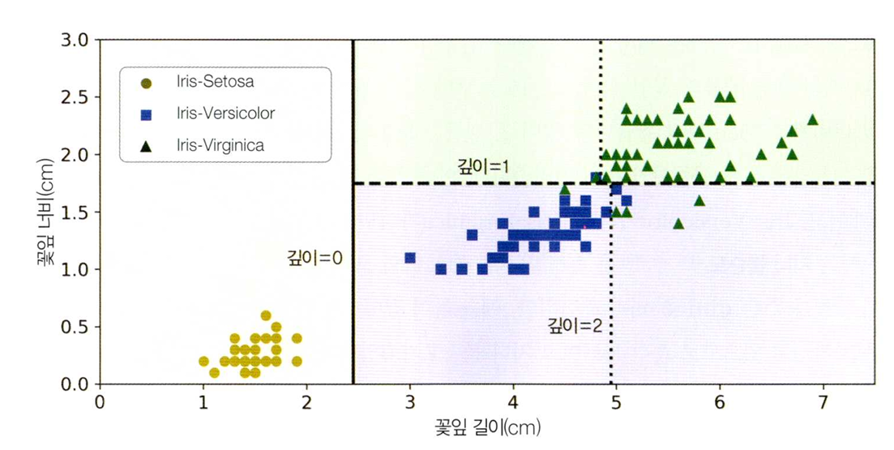

# Chapter 6. 결정 트리
## 6.1 결정 트리 학습과 시각화
### 결정 트리
분류, 회귀, 다중 출력 등을 수행할 수 있는 다목적 머신러닝 알고리즘, 랜덤 포레스트의 기본 구성 요소  
### 결정 트리 학습과 시각화
예제 코드 리포지토리 확인
## 6.2 예측
루트 노드에서부터 특성 값을 기준으로 이진 트리 형태로 분할해 내려감  
루트 노드 - 분할 노드 - 리프 노드 순으로 이어짐  
이런 식으로 제작된 각 노드에 대해 지니 불순도를 측정함.  
측정된 지니 불순도가 0이면 모든 샘플이 같은 클래스에 속하는 상태, 더 이상 분할할 필요 없음  
지니 불순도가 0이 아니면 분할할 수 있음, 분할은 설정해 둔 depth까지 수행  
depth는 결정 경계의 개수에 영향을 미침  

## 6.3 클래스 확률 추정
주어진 샘플의 리프 노드를 탐색하고 그 노드의 특정 클래스의 비율을 반환, 이 값이 특정 클래스일 확률이 됨
## 6.4 CART
CART 알고리즘을 사용해 훈련 세트를 반으로 나누는 작업을 계속 반복함 ( 불순도가 더 나은 분할을 찾을 수 없을 떄 까지)
이를 통해 결정 트리를 제작함
## 6.5 계산 복잡도
O(log(n))
## 6.6 지니 불순도, 엔트로피
결정 트리의 불순도로 지니 불순도 대신 엔드로피를 사용할 수 있음.
## 6.7 규제 매개변수
- max_features: 각 노드에서 분할에 사용할 특성의 최대 수
- max_leaf_nodes: 리프 노드의 최대 수
- min_samples_split : 분할되기 위해 노드가 가져야 하는 최소 샘플 수
- min_samples_leaf: 리프 노드가 생성되기 위해 가지고 있어야 할 최소 샘플 수
- min_weight_fraction_leaf: min_samples_leaf와 같지만 가중치가 부여된 전체 샘플 수에서의 비율
## 6.8 회귀
불순도 대신 Mean square error를 최소화하도록 분할하는 것 외에 차이점 없음
## 6.9 축 방향 민감성
축 방향에 민감함
## 6.10 분산 문제
분산이 큰 편인 모델이라 하이퍼파라미터 규제가 변경되면 크게 다른 모델이 될 수 있음.  
이를 해결하기 위해 랜덤 포레스트와 앙상블을 사용할 수 있음.
